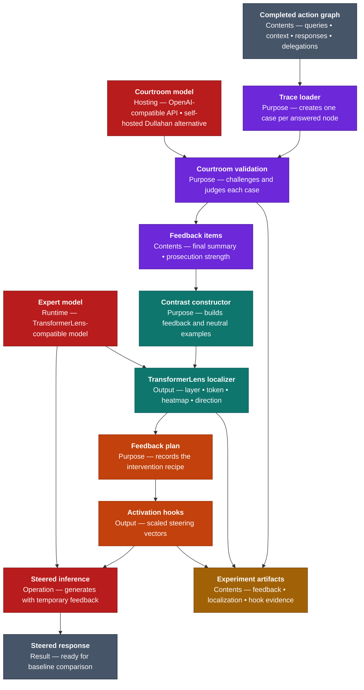
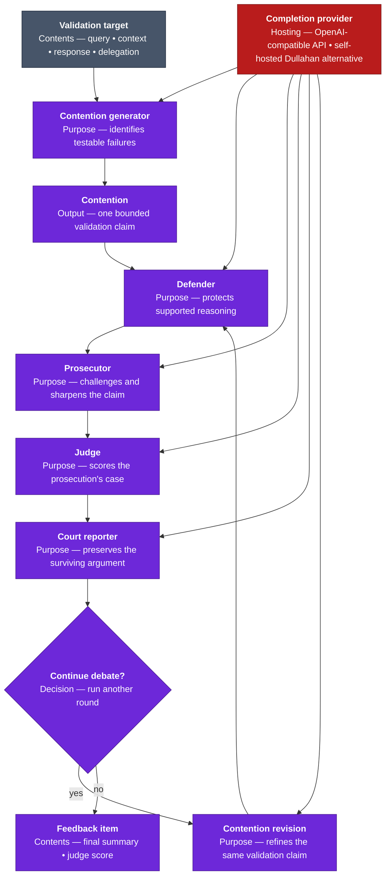
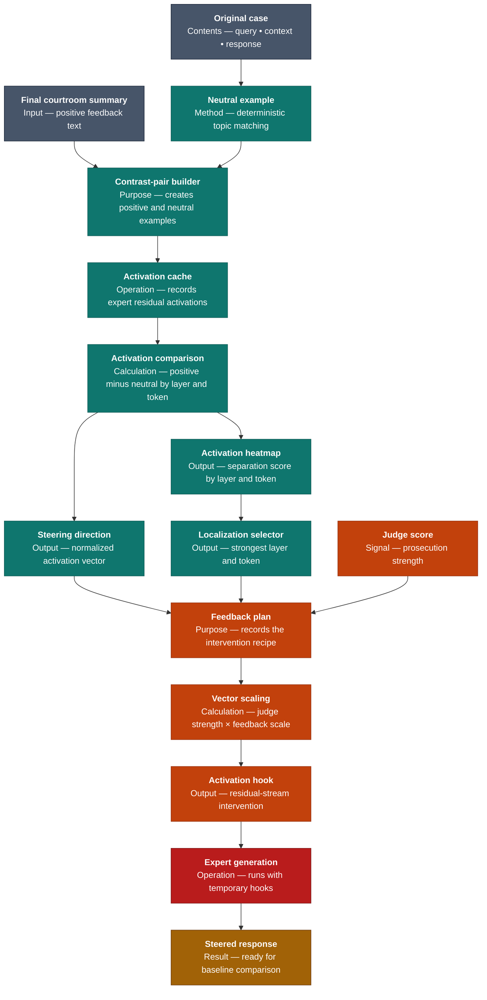

# Specter

Specter is an experimental validation and model-steering pipeline for specialist
language models working inside agent systems. Those systems can produce answers
that sound convincing while missing evidence, losing constraints during
delegation, or hiding uncertainty behind fluent prose. An execution trace can
show what happened, but it does not tell you whether the result deserved to be
trusted.

Specter turns that completed trace into a structured review. It gives each
answer and delegation a courtroom-style challenge, preserves the strongest
criticism as a feedback concept, and then asks the original model where that
concept appears in its internal activations. The result is a reversible steering
intervention that can be tested without retraining or permanently changing the
model.

The larger idea is to close the gap between auditing an agent and improving its
next inference. Specter does not stop at producing another critique document. It
turns the critique into an inspectable experiment: what was challenged, which
argument survived, where the model represented it, what vector was applied, and
how the model answered afterward.

## Quickstart: From An Agent Trace To A Steered Answer

The sequence below starts with a completed action graph and ends with a new model
response generated under reversible feedback hooks. The courtroom needs a text
generation endpoint. You can use the OpenAI API or another hosted
OpenAI-compatible service. The
[Dullahan](https://github.com/ForestDweller014/Dullahan) inference module is
simply the local, self-hosted alternative for those same courtroom calls: it
runs open-weight models through Ollama or vLLM and exposes an OpenAI-compatible
completion interface. Dullahan inference is not a separate feedback mechanism
and is not used for activation analysis, which still requires a
TransformerLens-compatible copy of the expert model.

### 1. Install Specter

From the repository root:

```bash
python -m pip install -e ".[dev,transformerlens]"
```

This installs four commands:

```text
specter-courtroom
specter-localize-feedback
specter-apply-feedback
specter-run-feedback-hooks
```

### 2. Point Specter At A Completed Action Graph

Specter expects a persisted graph whose nodes contain the query, supplied
context, expert response, and routing metadata. The broader Dullahan agent system
produces this file when a run uses `--persist-artifacts`, but any system can emit
the same simple contract.

```bash
export ACTION_GRAPH="/absolute/path/to/memory/executions/<trace_id>/action_graph.json"
```

At minimum, the document identifies the trace and its root query and provides
the graph's nodes and parent-to-child delegation edges:

```json
{
  "schema": "dullahan.action_graph.v1",
  "trace_id": "trace:...",
  "root_query_id": "query:...",
  "nodes": [],
  "edges": []
}
```

Each answered node becomes a separate validation target. Parent and child edges
let Specter review not only what an expert answered, but whether the delegated
question preserved the original task.

### 3. Run The Courtroom

For the recommended self-hosted route, clone Dullahan separately and install it
in the same Python environment as Specter. Then install Ollama and make the
configured model available:

```bash
cd ~/Documents/Dullahan
python -m pip install -e ".[dev]"
```

Keep `ollama serve` running in its own terminal:

```bash
ollama pull qwen3:8b
ollama serve
```

Then ask Specter to start Dullahan's inference proxy for the duration of the
courtroom run:

```bash
cd /absolute/path/to/Specter

specter-courtroom "$ACTION_GRAPH" \
  --repo-root "$PWD" \
  --rounds 1 \
  --contentions 1 \
  --start-dullahan-inference \
  --dullahan-repo-root ~/Documents/Dullahan \
  --persist
```

Start with one contention and one round to verify the complete path without
paying for dozens of model calls per target. Increase both only after inspecting
the first courtroom artifacts.

The command prints the generated feedback ID and artifact directory. Save that
path for the next stage:

```bash
export FEEDBACK_DIR="/absolute/path/to/Specter/memory/feedback/<feedback_id>"
```

If Dullahan inference is already running, omit
`--start-dullahan-inference`. To use the OpenAI API or another hosted
OpenAI-compatible endpoint instead of self-hosted Dullahan:

```bash
specter-courtroom "$ACTION_GRAPH" \
  --repo-root "$PWD" \
  --rounds 1 \
  --contentions 1 \
  --courtroom-model-provider openai-compatible \
  --courtroom-model-base-url https://api.openai.com/v1 \
  --courtroom-model "your-completion-model" \
  --courtroom-api-key-env OPENAI_API_KEY \
  --persist
```

### 4. Find The Feedback Inside The Expert Model

The courtroom produces language. This stage turns that language into a measured
activation direction. Use a TransformerLens-compatible model that matches the
expert architecture being studied:

```bash
export EXPERT_MODEL="your-transformerlens-compatible-model"

specter-localize-feedback "$FEEDBACK_DIR" \
  --model-path "$EXPERT_MODEL" \
  --contrast-pairs 1 \
  --n-layers 12
```

Specter compares each final courtroom summary with a topic-matched neutral text,
runs both through the model, and records the layer and token position where the
activation difference is strongest. It writes the heatmap, steering vector, and
`feedback_plan.json` into the same feedback directory.

### 5. Turn The Plan Into Reversible Hooks

```bash
specter-apply-feedback "$FEEDBACK_DIR/feedback_plan.json"
```

The command scales each steering vector by the judge's prosecution-strength
score and the configured feedback scale. It prints an application directory
containing `activation_hooks.json`:

```bash
export HOOKS="$FEEDBACK_DIR/applied/<application_id>/activation_hooks.json"
```

### 6. Rerun The Expert With Feedback Applied

```bash
specter-run-feedback-hooks "$HOOKS" \
  --model-path "$EXPERT_MODEL" \
  --expert-id "<expert-id-from-feedback>" \
  --prompt "Assess the deployment risk" \
  --max-new-tokens 128
```

This generation uses the same model with temporary residual-stream hooks. The
weights are unchanged when the process exits. Compare this output with the
unsteered baseline to determine whether the intervention improved the answer;
Specter does not currently make that quality judgment automatically.

## Tech Stack

| Category | Tools |
| --- | --- |
| Runtime and commands | Python, CLI entrypoints |
| Courtroom inference | OpenAI-compatible API; Dullahan inference is the self-hosted alternative |
| Activation analysis | PyTorch, TransformerLens |
| Contracts and artifacts | Pydantic, JSON, YAML |
| Architecture documentation | Mermaid |
| Validation | pytest, real local-inference integration tests |

## Architecture

The first view shows the whole journey. The next two open the courtroom and the
activation-steering stages without changing the story.

Every diagram uses the same palette: **purple** for validation, **teal** for
activation discovery, **orange** for feedback application, **red** for model
inference, **gold** for persisted evidence, and **slate** for external inputs and
outputs.



### Courtroom Validation

The courtroom is designed to make disagreement explicit before anyone tries to
change the model. A contention generator identifies concrete ways an answer or
delegation may have failed. The defender protects valid reasoning; the
prosecutor tests that defense; the judge records which side is stronger; and the
reporter compresses the state so later rounds can build on it without carrying
an ever-growing transcript.

These roles are separate prompts sent through real inference. They are
role-conditioned views of the case, not hard-coded verdicts. Every contention
keeps its identity across rounds, which makes the final criticism traceable back
to the exact target and argument that produced it.



### Activation Localization And Feedback Application

The second half asks a different question: if the final summary expresses the
criticism we want the expert to account for, where does that distinction appear
inside the expert model? Specter treats the summary as a positive example and a
neutral description of the same query, context, and response as the negative
example. TransformerLens measures their residual-stream difference rather than
guessing a layer from a hash or a rule.

The strongest normalized direction becomes a steering vector. The feedback plan
keeps that vector separate from the policy that applies it, so a reviewer can
change the scale, select an expert, or discard an intervention without repeating
the courtroom.



## From A Recorded Trace To Reversible Feedback

Specter's architectural bet is that validation becomes more useful when it can
travel all the way from a human-readable argument to a controlled change in
model behavior. Each module exists to preserve one part of that journey without
collapsing the entire experiment into an opaque model call.

### The trace turns a completed run into a case file

The process begins after an agent system has answered. `graph_loader` reads the
action graph and turns every answered node into a `FeedbackTargetNode`. The
target preserves the original query, the context the expert saw, its response,
its model and expert identity, and the edges that explain who delegated work to
whom.

That boundary matters because failures in an agent system are not confined to
the final prose. A specialist may answer its local question well while the
delegated question itself has drifted away from the parent's intent. By keeping
the trace structure, Specter can challenge both the response and the decision
that created it.

### The courtroom turns vague doubt into explicit claims

`courtroom` treats each target as a case rather than asking one model for a
generic critique. The contention generator proposes bounded, evidence-specific
claims. The debate runner carries each claim through defense, prosecution,
judgment, and reporting for the configured number of rounds. The judge contributes
a signed strength score, while the reporter maintains a compact narrative of
what survived.

This separation solves two problems. First, a criticism has to survive an
adversarial defense before it influences the model. Second, the artifacts retain
the reasoning trail, so a high score is never the only explanation available to
a reviewer.

### The reporter's summary becomes the candidate feedback concept

At the end of the final round, Specter stores one `FeedbackItem` per contention.
Its two most important fields are the running courtroom summary and the latest
prosecution-strength score. The summary supplies the meaning of the proposed
feedback; the score supplies its eventual magnitude.

This is an important current design choice: the summary itself is the positive
text used during activation discovery. Specter does not yet rewrite it into a
separate, tightly controlled correction statement. A clear, focused summary can
produce a useful direction; a summary full of courtroom rhetoric or several
mixed concepts can produce a less precise one.

### Contrast construction creates a measurable question

`activation/contrast_set_builder` pairs that summary with a neutral description
of the same query, the first context sentence, and the first response sentence.
The negative text is deterministic, not LLM-generated. This makes a localization
run cheap and reproducible, and it keeps the original topic present while
removing the explicit prosecution signal.

It is also the most deliberately simple part of the current research pipeline.
The positive examples repeat the same summary, and negative variants differ
mainly by an index. The pair is topic-matched, but it is not a rigorously
controlled linguistic minimal pair. That limitation is visible in the stored
metadata rather than hidden behind a claim that the contrast set is learned.

### TransformerLens finds where the distinction appears

`TransformerLensActivationLocator` runs every positive and negative text through
the real expert model and caches its residual activations. At each inspected
layer, it measures the average positive-minus-negative direction and asks where
that direction separates the two groups most strongly across token positions.

The output is a heatmap, a selected layer and token, a normalized direction
vector, and an evidence score. This is activation measurement, not another LLM
opinion. It identifies a promising intervention point, although a strong
projection should still be treated as experimental evidence rather than proof
that the direction is uniquely causal.

### The feedback plan separates discovery from intervention

`feedback/plan_builder` turns each localization into a small, portable recipe.
The plan records which contention and expert it belongs to, where the hook
should run, which vector file to load, the judge's strength, and the configured
feedback scale.

Keeping this plan outside the model is what makes the workflow reviewable. A
team can inspect the courtroom, replace a questionable contrast set, change the
scale, or reject a localization before anything touches inference. Discovery
and application are separate decisions.

### Hooked inference tests the correction without retraining

`feedback/apply_runtime` loads the vector and scales it by prosecution strength
and feedback scale. It writes an explicit hook specification instead of
modifying weights. `TransformerLensHookRunner` then adds the vector at the
selected residual-stream location while the expert generates a new answer.

The intervention lasts only for that run. This makes Specter useful as a
research and evaluation loop: compare baseline and steered behavior, adjust or
remove the hook, and preserve exactly what changed. If the result is promising,
the accumulated artifacts can later inform a more durable training or adapter
strategy; Specter itself does not perform that training.

### Persisted artifacts make the experiment auditable

Every stage writes human-readable or machine-readable evidence under
`memory/feedback/<feedback_id>/`. The filesystem is the handoff between
courtroom review, activation discovery, intervention design, and generation, so
no stage depends on an invisible in-memory conversation.

```text
memory/feedback/<feedback_id>/
  manifest.yaml
  final_feedback.yaml
  targets/<query_id>/
    target.yaml
    contentions.yaml
    rounds.yaml
    debate_summaries.yaml
    judge_scores.yaml
    final_feedback.yaml
  activation_localizations.yaml
  activation_heatmaps/
  steering_vectors/
  feedback_plan.json
  applied/<application_id>/
    activation_hooks.json
    manifest.yaml
```

| Artifact | Purpose |
| --- | --- |
| `final_feedback.yaml` | Final summary and judge strength for every validated contention |
| `targets/<query_id>/` | Complete case record: target, contentions, rounds, summaries, and scores |
| `activation_localizations.yaml` | Selected expert, layer, token, projection strength, and confidence |
| `activation_heatmaps/` | Layer-by-token evidence used to inspect the localization |
| `steering_vectors/` | Direction vectors derived from real expert-model activations |
| `feedback_plan.json` | Reviewable recipe connecting courtroom evidence to an intervention |
| `activation_hooks.json` | Fully materialized, reversible hooks used during generation |

## Where Specter Fits

Specter is most useful when a team already has structured agent traces and wants
to investigate whether specialist models can be corrected more precisely than
with another block of prompt text. It supports expert-response auditing,
delegation review, activation-steering research, and the creation of structured
evaluation evidence.

It is not currently a production safety gate, a model trainer, or an automatic
proof that a steered answer is better. It requires real courtroom inference and
a local TransformerLens-compatible expert model. Its contrast construction and
confidence scoring are intentionally visible research choices that should be
evaluated against the behavior of the model being studied.

## Development

Run the complete test suite:

```bash
pytest
```

Run the real local courtroom integration when Ollama and Dullahan's configured
model are available:

```bash
SPECTER_RUN_LOCAL_INFERENCE=1 \
DULLAHAN_REPO_ROOT=~/Documents/Dullahan \
pytest tests/test_real_inference.py::test_dullahan_inference_executes_every_courtroom_role -v
```

Set `SPECTER_TRANSFORMERLENS_MODEL` to a compatible model and run the complete
integration module to include real activation localization:

```bash
SPECTER_RUN_LOCAL_INFERENCE=1 \
DULLAHAN_REPO_ROOT=~/Documents/Dullahan \
SPECTER_TRANSFORMERLENS_MODEL="your-transformerlens-compatible-model" \
pytest tests/test_real_inference.py -m local_inference -v
```

## License

Specter is licensed under the [Apache License 2.0](LICENSE).
