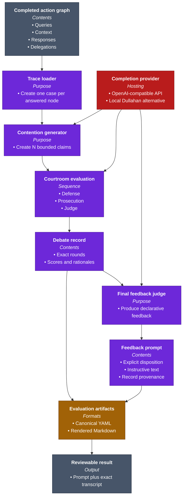
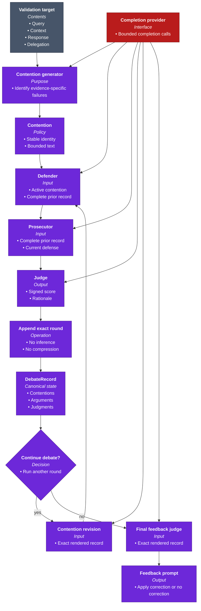
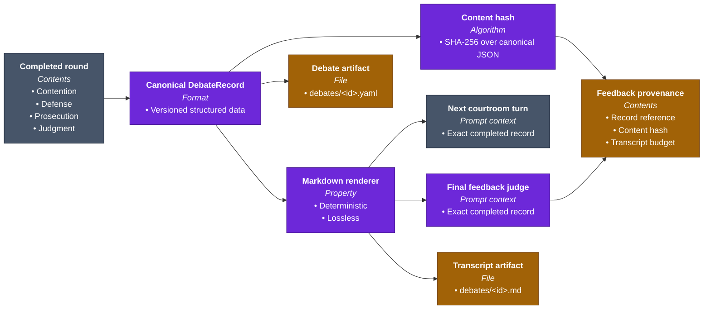

# Specter

Specter is a courtroom-style evaluation tool for language-model and agent-system
outputs. Agent traces can show which model answered, what context it received,
and how work was delegated, but they do not establish whether the answer was
well grounded, complete, or appropriately qualified.

Specter turns each answered trace node into a case. A prosecutor creates bounded,
evidence-specific contentions; a defender protects valid reasoning; the
prosecutor rebuts; and a judge records which side is stronger. After a configured
number of rounds, a final judge converts the exact debate into a concise,
instructive, declarative feedback prompt.

The output is deliberately modest: feedback text plus an auditable courtroom
record. Specter does not steer activations, construct contrast pairs, install
hooks, retrain a model, or silently deliver the feedback anywhere. Another person
or system may review and use the prompt, but that decision sits outside Specter.

The larger idea is that useful evaluation should survive inspection. Every later
courtroom role sees the complete prior record, every record has a stable content
hash, and the human-readable Markdown is rendered deterministically from the
canonical YAML data. No model-generated summary stands between the evidence and
the verdict.

## Quickstart: From An Agent Trace To Declarative Feedback

The sequence below starts with a completed action graph and ends with stored
debate transcripts and feedback prompts. The courtroom needs an
OpenAI-compatible completion endpoint. That can be a hosted service or a local
[Dullahan](https://github.com/ForestDweller014/Dullahan) inference server.

### 1. Install Specter

From the repository root:

```bash
python -m pip install -e ".[dev]"
```

This installs two names for the same focused command:

```text
specter
specter-courtroom
```

### 2. Point Specter At A Completed Action Graph

Specter reads the `dullahan.action_graph.v1` contract. Each answered node becomes
one evaluation target, while parent and child edges preserve the delegation
context that produced it.

```bash
export ACTION_GRAPH="/absolute/path/to/action_graph.json"
```

At minimum, the document identifies the trace and root query and includes its
nodes and directed delegation edges:

```json
{
  "schema": "dullahan.action_graph.v1",
  "trace_id": "trace:...",
  "root_query_id": "query:...",
  "nodes": [],
  "edges": []
}
```

An answered node retains its query, context documents, expert response, expert
identity, model routing metadata, parent question, delegated question, and child
questions. Unanswered nodes are skipped unless `--include-unanswered-nodes` is
set.

### 3. Run The Courtroom

If Dullahan's local inference module is already running at the default endpoint:

```bash
specter "$ACTION_GRAPH" \
  --rounds 3 \
  --contentions 3 \
  --turn-token-budget 512
```

To have Specter start Dullahan inference for the lifetime of the evaluation:

```bash
specter "$ACTION_GRAPH" \
  --start-dullahan-inference \
  --dullahan-repo-root ~/Documents/Dullahan
```

To use another OpenAI-compatible endpoint:

```bash
specter "$ACTION_GRAPH" \
  --courtroom-model-provider openai-compatible \
  --courtroom-model-base-url https://api.openai.com/v1 \
  --courtroom-model "your-completion-model" \
  --courtroom-api-key-env OPENAI_API_KEY
```

The same generous `--turn-token-budget` bounds every contention, contention
revision, defense, and prosecution argument. Judge rationales and final feedback
have their own bounded budgets. Start with one contention and one round when
validating a new endpoint; increase both only after inspecting the resulting
record and cost.

### 4. Read The Result

The normal command output prints every final feedback prompt:

```text
Evaluation: evaluation:...
Source trace: trace:...
Targets: 1
Contentions: 1
Artifacts: artifacts/evaluations/evaluation_...

Feedback prompts:
- [apply_correction] State the missing rollback risk explicitly and calibrate the conclusion to the supplied evidence.
```

Use `--json` when another tool needs the complete typed result. Use
`--output-dir` to change where the durable evaluation artifacts are written.
Persistence is the default because a feedback prompt without its evidence trail
is not a complete Specter result.

### 5. Inspect The Exact Transcript

Each contention produces a canonical YAML record and a deterministic Markdown
view:

```text
artifacts/evaluations/<evaluation_id>/
  manifest.yaml
  feedback_prompts.yaml
  targets/<query_id>/
    target.yaml
    contentions.yaml
    feedback_prompts.yaml
    debates/<contention_id>.yaml
    debates/<contention_id>.md
```

The final prompt's provenance contains `debate_record_ref`, the SHA-256 content
hash of the canonical record, and the calculated transcript budget. Recompute
the hash from the YAML record whenever you need to verify that the evidence has
not changed.

## Tech Stack

| Category | Tools |
| --- | --- |
| Runtime and command | Python 3.11+, CLI entrypoint |
| Courtroom inference | OpenAI-compatible completions; optional local Dullahan process |
| Contracts and artifacts | Pydantic, JSON, YAML, Markdown, SHA-256 |
| Architecture documentation | Mermaid |
| Validation | pytest, Ruff, GitHub Actions |

## Architecture

The first view shows the complete target journey. The next two open the courtroom
and the artifact boundary.

Every diagram uses the same palette: **purple** for evaluation, **red** for model
inference, **gold** for persisted evidence, and **slate** for external inputs and
outputs.

Multi-line nodes also share one internal hierarchy: the **bold first line** is
the module, service, artifact, or decision name; the *italic second line* labels
the information below it; and bullets identify inputs, outputs, capabilities,
policies, interfaces, or stored data.



### Courtroom Evaluation

The courtroom makes disagreement explicit without filtering it through a
separate summarizer. For each contention and round, the defender sees the full
completed record and protects supported reasoning. The prosecutor sees that
same record plus the current defense and rebuts it. The judge sees the record and
both current arguments, then returns a score from `-1` to `1` and a rationale.

After judgment, code appends the exact round to the `DebateRecord`. The next
round's contention revision, defense, prosecution, and judge all receive the
record's deterministic Markdown view. When the rounds end, the final judge
receives that exact view. Scores do not travel through a second side channel;
they are already part of each structured round.



### Structured Evidence And Deterministic Views

The YAML record owns the data. Markdown is only a deterministic view used for
prompts and human inspection. The hash covers the canonical JSON serialization
of the typed record, so formatting changes cannot masquerade as evidence
changes.



## From A Recorded Trace To Reviewable Feedback

Specter's architectural bet is that a debate is useful only when the evidence
that shaped it remains available. Each module preserves one part of that journey
without turning evaluation into an opaque, recursively summarized conversation.

### The trace becomes a set of case files

`graph_loader` validates the action-graph schema and creates one
`FeedbackTargetNode` for every answered node. A target keeps both local evidence
and graph position: the original query, supplied context, response, expert and
model identities, parent intent, delegation wording, and child questions.

This matters because an agent may answer its local question well while the
delegation itself has drifted away from the user's task. Specter therefore gives
the contention generator enough context to challenge both response quality and
task preservation.

### Initial contentions make criticism concrete

`InferenceContentionGenerator` asks the configured model for up to `N` distinct,
evidence-specific contentions in one structured call. Each contention receives a
stable identity and the configured turn budget. The generator orders the
strongest claim first and rejects an empty result.

Contentions may address grounding, omitted constraints, missing uncertainty,
delegation quality, or reasoning. They are claims to test, not conclusions. Each
one must survive its own independent debate before it can produce feedback.

### Debate rounds preserve every side of the argument

`CourtroomRunner` performs `M` rounds for every contention. Later rounds may
revise the wording, but the contention identity remains stable. A complete round
stores the active contention, defense, prosecution argument, judge score, and
judge rationale.

The score is signed: `-1` means the defense is strongest, `0` means mixed,
neutral, or unclear, and `1` means the prosecution is strongest. Intermediate
values preserve calibrated strength, such as `0.42`, without pretending that a
single number replaces the rationale.

### The record replaces the reporter

There is no court-reporter role and no summarization inference call. After every
round, Specter appends the exact structured data to `DebateRecord` and renders it
as Markdown. That removes recursive summary drift, silent evidence loss,
additional inference cost, and a source of nondeterminism.

The maximum transcript budget is calculated before the debate:

```text
turn_budget
+ rounds × (3 × turn_budget + judge_rationale_budget + 64)
+ 32
```

The three bounded turns per round are the active contention, defense, and
prosecution. Fixed allowances cover headings, score labels, and separators. The
bound is conservative; the record is never cut to fit it.

### The final judge emits text, not an intervention

`judge_feedback` reads the complete rendered record and returns strict JSON with
an explicit `apply_correction` or `no_correction` disposition. When correction
is warranted, `feedback_prompt` is one concise, instructive, declarative prompt.
When it is not, the same field records a concise audit reason.

The prompt never contains activation coordinates, hook instructions, steering
scales, or model-editing plans. Specter's responsibility ends at reviewable
language and evidence.

### Artifacts make the result independently inspectable

`EvaluationArtifactStore` writes each typed record once as YAML and derives its
Markdown view directly from that object. The top-level and per-target feedback
files retain the target evidence, final signed strength, disposition, declarative
prompt, record reference, content hash, and calculated transcript budget.

There are intentionally no `debate_summaries.yaml`, activation heatmaps,
contrast sets, steering vectors, feedback plans, or hook bundles. Their absence
is part of the project boundary, not an unfinished pipeline stage.

## Design Boundaries

Specter is an evaluation and feedback-authoring tool. It does:

- load structured action traces;
- generate bounded validation contentions;
- run adversarial defense, prosecution, and judgment rounds;
- preserve exact structured debates and deterministic Markdown transcripts;
- produce explicit, declarative feedback prompts with verifiable provenance.

Specter does not:

- summarize the debate with an LLM;
- use TransformerLens or inspect internal activations;
- construct contrastive pairs or steering directions;
- apply hooks, adapters, or weight changes;
- inject feedback into another prompt or model automatically;
- claim that a judge score is a production safety guarantee.

This boundary keeps the output portable. A human reviewer, benchmark harness,
prompt-management system, or training pipeline can decide how to consume an
approved prompt without coupling that decision to the evaluation itself.

## Development

Run the complete local integration contract:

```bash
python -m ruff check .
python -m ruff format --check .
python -m pytest -q
```

The test suite verifies action-graph loading, bounded request budgets, exact
record reuse across rounds, strict final-judge output, deterministic Markdown,
stable hashes, artifact provenance, CLI output, and the absence of reporter and
steering artifacts.

After changing code, refresh the architecture graph:

```bash
graphify update .
```

## License

Specter is licensed under the [Apache License 2.0](LICENSE).
