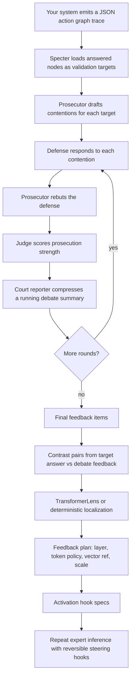
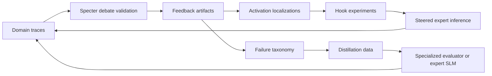

# Specter

Specter is a validation and steering layer for expert small language models
(SLMs). It takes a structured trace from an agent, router, workflow, evaluation
run, or plain batch inference job; turns each answered step into a validation
target; conducts bounded debate rounds between prosecutor, defense, judge, and
court-reporter roles; then converts the resulting feedback into activation-level
steering artifacts.

The core idea is simple: a critique should not only be appended to the next
prompt and hoped for. Specter uses the critique to build contrastive feedback,
localizes where that feedback activates in the expert model with TransformerLens,
and emits reversible hook specs that can steer a repeated inference at a chosen
residual-stream layer and token position. This gives researchers and builders a
more precise control surface than contextual feedback that can get diluted inside
a long prompt.

Specter is most useful when you already have specialist models or specialist
agents producing answers, and you need a post-hoc validation pass that is
structured, repeatable, inspectable, and capable of becoming model-internal
feedback.

## How It Works



Specter currently exposes the pipeline as four explicit commands:

1. `specter-courtroom`: validate trace targets with debate roles.
2. `specter-localize-feedback`: convert debate feedback into activation
   localization artifacts.
3. `specter-apply-feedback`: materialize feedback-plan items as hook specs.
4. `specter-run-feedback-hooks`: rerun a compatible TransformerLens model with
   those hooks.

The deterministic backend lets you test the full artifact flow without a model.
The TransformerLens backend is for real activation localization and hooked
inference.

## Install

From the repository root:

```bash
python -m pip install -e ".[dev]"
```

For TransformerLens localization and hooked generation:

```bash
python -m pip install -e ".[dev,transformerlens]"
```

Installed CLIs:

```bash
specter-courtroom --help
specter-localize-feedback --help
specter-apply-feedback --help
specter-run-feedback-hooks --help
```

## What Input Does Specter Take?

Specter consumes a JSON action graph trace. The trace can come from any project
as long as it can be distilled into this shape:

```json
{
  "schema": "specter.action_graph.v1",
  "trace_id": "trace:example-001",
  "root_query_id": "query:root",
  "nodes": [
    {
      "id": "query:root",
      "depth": 0,
      "sender_id": "user",
      "query": {
        "query": "Review this deployment plan for production readiness."
      },
      "context": null,
      "response": null,
      "responses": []
    },
    {
      "id": "query:risk",
      "depth": 1,
      "sender_id": "query:root",
      "query": {
        "query": "Assess rollout risk for the GPU inference service."
      },
      "context": {
        "documents": [
          {
            "id": "doc:1",
            "text": "The service uses dynamic GPU node provisioning and a shared Redis cache."
          }
        ]
      },
      "response": {
        "expert_id": "expert:infra-slm",
        "response": "The rollout risk is moderate if autoscaling and cache failover are tested.",
        "confidence": 0.74,
        "routing_metadata": {
          "model": "infra-specialist-small"
        }
      },
      "responses": []
    }
  ],
  "edges": [
    {
      "id": "edge:root-risk",
      "source": "query:root",
      "target": "query:risk",
      "query": "Assess rollout risk for the GPU inference service.",
      "label": "risk assessment"
    }
  ]
}
```

Required top-level fields:

| Field | Type | Meaning |
| --- | --- | --- |
| `schema` | string | Use `specter.action_graph.v1`. |
| `trace_id` | string | Stable ID for this run, request, eval case, or workflow execution. |
| `root_query_id` | string | ID of the root task or root question. |
| `nodes` | array | Tasks, subtasks, agent steps, tool decisions, routed queries, or eval cases. |
| `edges` | array | Parent-child relationships between nodes. |

Required node fields:

| Field | Type | Meaning |
| --- | --- | --- |
| `id` | string | Stable node ID. |
| `query.query` | string | The instruction/question/task being answered. |
| `response.expert_id` | string | Expert, model, agent, policy, tool, or route that produced the answer. |
| `response.response` | string | The answer Specter should validate. |

Useful optional node fields:

| Field | Why It Helps |
| --- | --- |
| `context.documents[].text` | Lets the courtroom test grounding and missing evidence. |
| `responses[]` | Allows traces that store multiple candidate responses. |
| `response.routing_metadata.model` | Names the underlying model separately from the expert ID. |
| `depth` | Helps inspect where the target sits in a larger reasoning graph. |
| `sender_id` | Captures who delegated the task. |

Useful edge fields:

| Field | Why It Helps |
| --- | --- |
| `source` / `target` | Connects parent tasks to child tasks. |
| `query` | Lets Specter validate whether the delegated query preserved the parent intent. |
| `label` | Makes artifacts easier to inspect. |

If your project does not have graph traces, create one node per answer and omit
edges. If your project has an agent trace, tool trace, workflow DAG, map-reduce
task tree, router log, or evaluation dataset, map each answered unit into a node
and each delegation/dependency into an edge.

## Quick Start

Create `example_action_graph.json`:

```json
{
  "schema": "specter.action_graph.v1",
  "trace_id": "trace:quickstart",
  "root_query_id": "query:root",
  "nodes": [
    {
      "id": "query:root",
      "depth": 0,
      "sender_id": "user",
      "query": {"query": "Decide whether this answer is safe to ship."},
      "context": null,
      "response": null,
      "responses": []
    },
    {
      "id": "query:answer",
      "depth": 1,
      "sender_id": "query:root",
      "query": {"query": "Assess whether the migration plan handles rollback."},
      "context": {
        "documents": [
          {"id": "doc:plan", "text": "The plan mentions staged deploys but does not define rollback ownership."}
        ]
      },
      "response": {
        "expert_id": "expert:release-slm",
        "response": "The migration plan is ready because it uses staged deploys.",
        "confidence": 0.82
      },
      "responses": []
    }
  ],
  "edges": [
    {
      "id": "edge:root-answer",
      "source": "query:root",
      "target": "query:answer",
      "query": "Assess whether the migration plan handles rollback."
    }
  ]
}
```

Run debate validation:

```bash
specter-courtroom ./example_action_graph.json \
  --repo-root . \
  --rounds 3 \
  --contentions 4 \
  --persist
```

This writes:

```text
memory/feedback/<feedback_id>/
  manifest.yaml
  final_feedback.yaml
  targets/<query_id>/
    target.yaml
    contentions.yaml
    rounds.yaml
    debate_summaries.yaml
    judge_scores.yaml
    final_feedback.yaml
```

Localize feedback with the deterministic backend:

```bash
specter-localize-feedback memory/feedback/<feedback_id> \
  --backend deterministic \
  --contrast-pairs 8
```

For real TransformerLens localization:

```bash
specter-localize-feedback memory/feedback/<feedback_id> \
  --backend transformerlens \
  --model-path ./models/expert-slm \
  --contrast-pairs 32
```

Materialize activation hooks:

```bash
specter-apply-feedback memory/feedback/<feedback_id>/feedback_plan.json \
  --mode activation-hook
```

Rerun a compatible expert model with hooks:

```bash
specter-run-feedback-hooks \
  memory/feedback/<feedback_id>/applied/<application_id>/activation_hooks.json \
  --model-path ./models/expert-slm \
  --expert-id expert:release-slm \
  --prompt "Assess whether the migration plan handles rollback."
```

## Model-Backed Courtroom Roles

By default, courtroom roles are deterministic so local tests and artifact
generation work without a running model server. To use a model server for the
defender, prosecutor, judge, and court reporter, point Specter at an
OpenAI-compatible HTTP endpoint:

```bash
specter-courtroom ./example_action_graph.json \
  --repo-root . \
  --courtroom-model-provider http \
  --courtroom-model-base-url http://127.0.0.1:30000/v1 \
  --persist
```

Use deterministic mode when validating integration plumbing. Use model-backed
roles when you want higher-quality debate content, better judge rationales, and
feedback summaries worth localizing into steering vectors.

## Exact Use Cases

Specter is built for cases where the answer itself is not enough. You need to
know whether the answer survived structured opposition, whether it respected the
delegated task, and whether the critique can be carried into the model's next
inference step.

| Use case | What you feed Specter | What Specter gives back |
| --- | --- | --- |
| Specialist SLM validation | Query, context, expert ID, model answer | Contentions, debate transcripts, judge scores, feedback items. |
| Agent trace auditing | A graph of delegated tasks and responses | Per-node validation plus checks on whether child tasks preserved parent intent. |
| Router or expert selection review | Route decisions encoded as nodes/edges | Evidence that the selected expert answered the right task with enough context. |
| High-risk answer review | Generated answer plus retrieved/source context | Grounding, omission, overclaiming, and confidence critiques. |
| Steering research | Debate feedback and a TransformerLens-compatible model | Layer/token localization, heatmaps, steering vectors, and hook specs. |
| Regression/eval generation | Repeated traces from the same workflow | Structured artifacts for benchmarks, distillation, and failure taxonomies. |

Specter is a poor fit for low-stakes chat UX, simple deterministic business
rules, or systems where you only need aggregate benchmark scores. It is designed
for answer-level and trace-level inspection where the cost of a validation pass
is justified.

## Why Use This Paradigm?

Most validation systems stop at one of three surfaces:

1. A scalar score.
2. A natural-language critique.
3. A revised prompt.

Those are useful, but they leave a gap. A score does not explain how to change
the model's next inference. A critique can be ignored or diluted by context. A
revised prompt is still indirect control.

Specter keeps the natural-language audit trail, then attempts to translate the
strongest validated critique into a model-internal intervention. The intended
benefit is not that debate is magically correct. The benefit is that each step is
bounded and inspectable:

| Step | Why it matters |
| --- | --- |
| Prosecutor contentions | Forces concrete failure hypotheses instead of vague critique. |
| Defense responses | Prevents one-sided criticism from becoming the whole signal. |
| Judge scores | Converts each dispute into a signed strength value. |
| Running summaries | Compresses multi-round debate into a localization target. |
| Contrast pairs | Turns feedback into positive/negative activation examples. |
| Layer localization | Looks for where the expert model represents the feedback concept. |
| Hook specs | Makes steering reversible, inspectable, and reproducible. |

Use Specter when you want a bridge between symbolic/agentic validation and
representation-level model steering.

## Comparison With Adjacent Tools And Patterns

Specter is not a replacement for agent frameworks, evaluation harnesses, or
observability products. It sits after generation and before repeated inference,
where validation feedback can be turned into activation-level controls.

| Tool or pattern | Primary job | Where Specter differs |
| --- | --- | --- |
| LangGraph | Build stateful graph-shaped agent workflows. | Specter validates completed traces from any workflow and emits steering artifacts. |
| AutoGen / CrewAI style multi-agent collaboration | Coordinate role-based agents to solve tasks. | Specter uses roles as an adversarial validation protocol over existing answers, not as the main task solver. |
| LlamaIndex / RAG evaluators | Evaluate retrieval, faithfulness, and answer quality. | Specter can consume retrieved context, but also validates delegation structure and produces hookable feedback plans. |
| DeepEval / Ragas / promptfoo | Run metric-driven LLM evaluations and regression tests. | Specter is per-trace and feedback-producing; it keeps debate artifacts and can localize feedback into model activations. |
| Guardrails / NeMo Guardrails | Enforce policy and output constraints at the application boundary. | Specter is a post-hoc validation and steering layer, not a rule/policy gate. |
| Constitutional AI / critique-and-revise loops | Generate critiques and revised answers through prompting. | Specter preserves debate structure, judge scores, and activation-localized steering rather than relying only on added prompt text. |
| Representation engineering / CAA | Build activation directions from contrast sets. | Specter derives contrastive steering targets from validated debate feedback tied to concrete trace nodes. |
| TransformerLens | Inspect and intervene in transformer activations. | Specter wraps TransformerLens in an end-to-end feedback workflow from trace to courtroom to hook specs. |

## Scalability

Specter is intentionally artifact-first. That makes early usage simple and makes
larger deployments easier to reason about.

| Axis | Current mechanism | Scaling path |
| --- | --- | --- |
| Trace ingestion | JSON files passed to `specter-courtroom`. | Batch loaders, queue consumers, or direct integration from your workflow runtime. |
| Validation parallelism | One process validates targets from a trace. | Split nodes across workers; persist feedback under shared object storage. |
| Courtroom role inference | Deterministic mode or OpenAI-compatible HTTP. | Serve role models behind dedicated inference endpoints. |
| Activation localization | Deterministic backend or TransformerLens. | GPU localization workers, cached activations, and offline heatmap stores. |
| Hooked inference | Local TransformerLens generation. | Wrap expert serving endpoints with hook-aware inference runtimes. |
| Artifact storage | YAML/JSON under `memory/feedback`. | S3-compatible object storage plus metadata indexing. |
| Governance | Human-readable feedback artifacts. | Dashboards over judge scores, contention classes, and repeated failure modes. |

The natural large-scale architecture is asynchronous: emit traces from production
or evaluation jobs, validate them in batches, localize high-value feedback on GPU
workers, then promote only trusted hook specs or distilled policies into the
serving path.

## Domain Adaptation

Specter can adapt to specialized domains in two complementary ways:

1. Specialize the trace: include domain-specific context, evidence, route
   metadata, confidence fields, citations, tool outputs, and task hierarchy.
2. Specialize the courtroom and steering loop: use domain-tuned role models,
   domain-specific contention templates, and repeated feedback artifacts for
   distillation.

Domain-specific learning loop:



Examples:

| Domain | Specialized validation focus |
| --- | --- |
| Code intelligence | Repository ownership errors, missing call paths, shallow dependency analysis. |
| Cloud operations | IAM risk, rollback gaps, unreliable scaling assumptions, incident blast radius. |
| Security review | Threat-model omissions, weak exploit reasoning, missing mitigations. |
| Legal or policy review | Unsupported claims, missing exceptions, bad citation grounding. |
| Biomedical research | Dataset mismatch, overstated conclusions, missing methods caveats. |
| Financial research | Hidden assumptions, ignored downside scenarios, weak evidence. |
| Customer support | Wrong escalation path, missing account constraints, overconfident resolution. |

Over time, the artifacts can become training data for specialized judges,
prosecutors, route validators, adapters, or expert SLMs.

## Artifact Reference

After courtroom validation:

```text
memory/feedback/<feedback_id>/
  manifest.yaml
  final_feedback.yaml
  targets/<query_id>/
    target.yaml
    contentions.yaml
    rounds.yaml
    debate_summaries.yaml
    judge_scores.yaml
    final_feedback.yaml
```

After localization:

```text
memory/feedback/<feedback_id>/
  activation_localizations.yaml
  activation_heatmaps/*.json
  steering_vectors/*.json
  feedback_plan.json
```

After applying feedback:

```text
memory/feedback/<feedback_id>/applied/<application_id>/
  activation_hooks.json
  manifest.yaml
```

The hook scale for each plan item is:

```text
scaled_vector = direction_vector * prosecution_strength * feedback_scale
```

Positive prosecution strength pushes toward the localized critique direction.
Negative strength weakens or reverses that item because the judge found the
defense stronger.

## Development

Run tests:

```bash
pytest -q
```

Run CLI smoke checks:

```bash
specter-courtroom --help
specter-localize-feedback --help
specter-apply-feedback --help
specter-run-feedback-hooks --help
```
