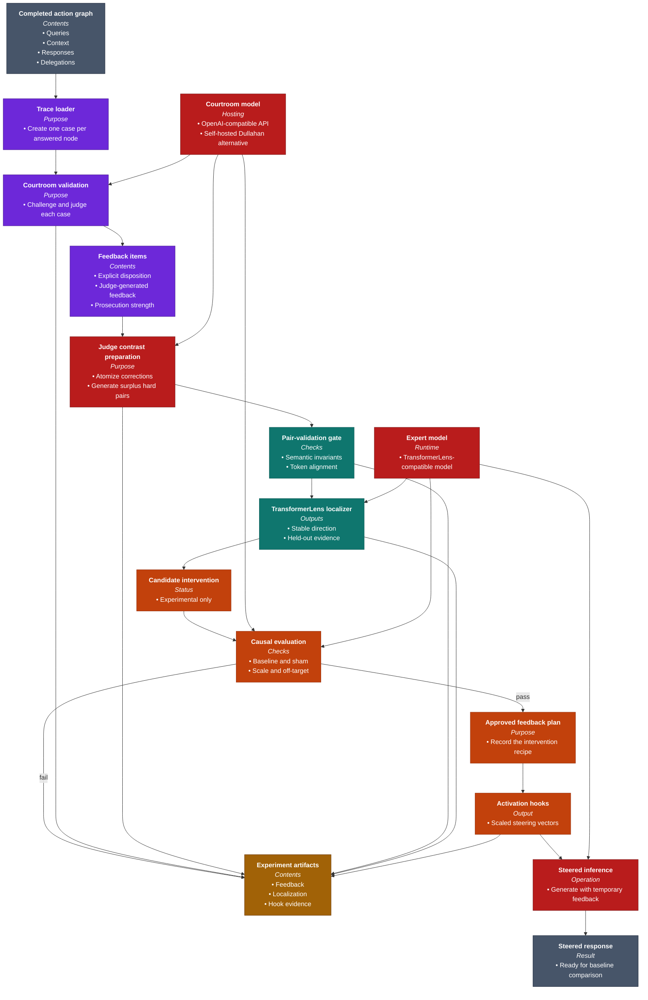
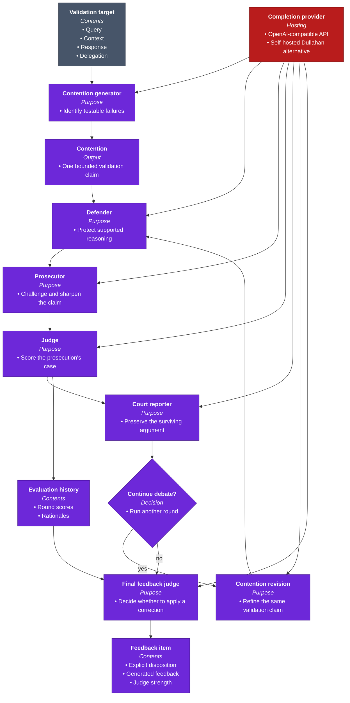
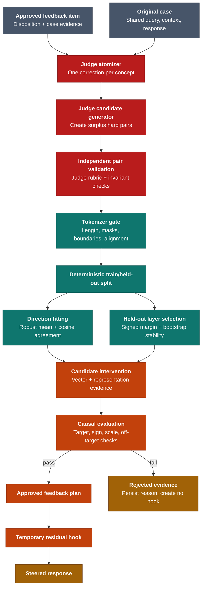
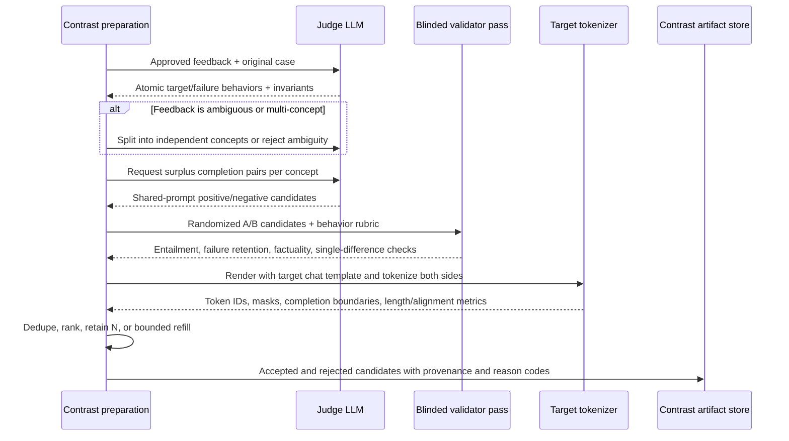
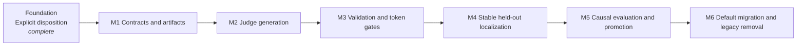

# Specter

Specter is an experimental validation and model-steering pipeline for specialist
language models working inside agent systems. Those systems can produce answers
that sound convincing while missing evidence, losing constraints during
delegation, or hiding uncertainty behind fluent prose. An execution trace can
show what happened, but it does not tell you whether the result deserved to be
trusted.

Specter turns that completed trace into a structured review. It gives each
answer and delegation a courtroom-style challenge, preserves the strongest
criticism as a feedback concept, and then asks the original model where that
concept appears in its internal activations. The result is a reversible steering
intervention that can be tested without retraining or permanently changing the
model.

The larger idea is to close the gap between auditing an agent and improving its
next inference. Specter does not stop at producing another critique document. It
turns the critique into an inspectable experiment: what was challenged, which
argument survived, where the model represented it, what vector was applied, and
how the model answered afterward.

## Quickstart: From An Agent Trace To A Steered Answer

The sequence below starts with a completed action graph and ends with a new model
response generated under reversible feedback hooks. The courtroom needs a text
generation endpoint. You can use the OpenAI API or another hosted
OpenAI-compatible service. The
[Dullahan](https://github.com/ForestDweller014/Dullahan) inference module is
simply the local, self-hosted alternative for those same courtroom calls: it
runs open-weight models through Ollama or vLLM and exposes an OpenAI-compatible
completion interface. Dullahan inference is not a separate feedback mechanism
and is not used for activation analysis, which still requires a
TransformerLens-compatible copy of the expert model.

### 1. Install Specter

From the repository root:

```bash
python -m pip install -e ".[dev,transformerlens]"
```

This installs four commands:

```text
specter-courtroom
specter-localize-feedback
specter-apply-feedback
specter-run-feedback-hooks
```

### 2. Point Specter At A Completed Action Graph

Specter expects a persisted graph whose nodes contain the query, supplied
context, expert response, and routing metadata. The broader Dullahan agent system
produces this file when a run uses `--persist-artifacts`, but any system can emit
the same simple contract.

```bash
export ACTION_GRAPH="/absolute/path/to/memory/executions/<trace_id>/action_graph.json"
```

At minimum, the document identifies the trace and its root query and provides
the graph's nodes and parent-to-child delegation edges:

```json
{
  "schema": "dullahan.action_graph.v1",
  "trace_id": "trace:...",
  "root_query_id": "query:...",
  "nodes": [],
  "edges": []
}
```

Each answered node becomes a separate validation target. Parent and child edges
let Specter review not only what an expert answered, but whether the delegated
question preserved the original task.

### 3. Run The Courtroom

For the recommended self-hosted route, clone Dullahan separately and install it
in the same Python environment as Specter. Then install Ollama and make the
configured model available:

```bash
cd ~/Documents/Dullahan
python -m pip install -e ".[dev]"
```

Keep `ollama serve` running in its own terminal:

```bash
ollama pull qwen3:8b
ollama serve
```

Then ask Specter to start Dullahan's inference proxy for the duration of the
courtroom run:

```bash
cd /absolute/path/to/Specter

specter-courtroom "$ACTION_GRAPH" \
  --repo-root "$PWD" \
  --rounds 1 \
  --contentions 1 \
  --start-dullahan-inference \
  --dullahan-repo-root ~/Documents/Dullahan \
  --persist
```

Start with one contention and one round to verify the complete path without
paying for dozens of model calls per target. Increase both only after inspecting
the first courtroom artifacts.

The command prints the generated feedback ID and artifact directory. Save that
path for the next stage:

```bash
export FEEDBACK_DIR="/absolute/path/to/Specter/memory/feedback/<feedback_id>"
```

If Dullahan inference is already running, omit
`--start-dullahan-inference`. To use the OpenAI API or another hosted
OpenAI-compatible endpoint instead of self-hosted Dullahan:

```bash
specter-courtroom "$ACTION_GRAPH" \
  --repo-root "$PWD" \
  --rounds 1 \
  --contentions 1 \
  --courtroom-model-provider openai-compatible \
  --courtroom-model-base-url https://api.openai.com/v1 \
  --courtroom-model "your-completion-model" \
  --courtroom-api-key-env OPENAI_API_KEY \
  --persist
```

### 4. Find The Feedback Inside The Expert Model

The courtroom produces language. This stage turns that language into a measured
activation direction. Use a TransformerLens-compatible model that matches the
expert architecture being studied:

```bash
export EXPERT_MODEL="your-transformerlens-compatible-model"

specter-localize-feedback "$FEEDBACK_DIR" \
  --model-path "$EXPERT_MODEL" \
  --contrast-pairs 1 \
  --n-layers 12
```

Specter compares each judge-approved feedback instruction with a topic-matched
neutral text, runs both through the model, and records the layer and token
position where the activation difference is strongest. It writes the heatmap,
steering vector, and `feedback_plan.json` into the same feedback directory.

### 5. Turn The Plan Into Reversible Hooks

```bash
specter-apply-feedback "$FEEDBACK_DIR/feedback_plan.json"
```

The command scales each steering vector by the judge's prosecution-strength
score and the configured feedback scale. It prints an application directory
containing `activation_hooks.json`:

```bash
export HOOKS="$FEEDBACK_DIR/applied/<application_id>/activation_hooks.json"
```

### 6. Rerun The Expert With Feedback Applied

```bash
specter-run-feedback-hooks "$HOOKS" \
  --model-path "$EXPERT_MODEL" \
  --expert-id "<expert-id-from-feedback>" \
  --prompt "Assess the deployment risk" \
  --max-new-tokens 128
```

This generation uses the same model with temporary residual-stream hooks. The
weights are unchanged when the process exits. Compare this output with the
unsteered baseline to determine whether the intervention improved the answer;
Specter does not currently make that quality judgment automatically.

## Tech Stack

| Category | Tools |
| --- | --- |
| Runtime and commands | Python, CLI entrypoints |
| Courtroom inference | OpenAI-compatible API; Dullahan inference is the self-hosted alternative |
| Activation analysis | PyTorch, TransformerLens |
| Contracts and artifacts | Pydantic, JSON, YAML |
| Architecture documentation | Mermaid |
| Validation | pytest, real local-inference integration tests |

## Architecture

The first view shows the target journey. The next two open the courtroom and the
activation-steering stages. Judge-generated contrast preparation, held-out
localization, and causal promotion are planned boundaries; the current
deterministic contrast path remains documented below for an honest migration
baseline.

Every diagram uses the same palette: **purple** for validation, **teal** for
activation discovery, **orange** for feedback application, **red** for model
inference, **gold** for persisted evidence, and **slate** for external inputs and
outputs.

Multi-line nodes also share one internal hierarchy: the **bold first line** is
the module, service, artifact, or decision name; the *italic second line* labels
the information below it; and bullets identify its inputs, outputs,
capabilities, policies, interfaces, or stored data.



### Courtroom Validation

The courtroom is designed to make disagreement explicit before anyone tries to
change the model. A contention generator identifies concrete ways an answer or
delegation may have failed. The defender protects valid reasoning; the
prosecutor tests that defense; the judge records which side is stronger; and the
reporter compresses the state so later rounds can build on it without carrying
an ever-growing transcript. Once the rounds end, a final feedback judge reads
that summary together with every round's score and rationale, then returns an
explicit `apply_correction` or `no_correction` disposition. Only approved,
positively scored corrections continue to activation localization.

These roles are separate prompts sent through real inference. They are
role-conditioned views of the case, not hard-coded verdicts. Every contention
keeps its identity across rounds, which makes the final criticism traceable back
to the exact target and argument that produced it.



### Activation Localization And Feedback Application

The second half asks a different question: if the final judge approved feedback
expresses the correction we want the expert to follow, where does that
distinction appear inside the expert model? The current implementation contrasts
the generated feedback with a deterministic neutral description. The target
architecture replaces that research scaffold with judge-generated behavioral
pairs, independent validation, held-out representation tests, and causal
promotion before a hook becomes generally applicable.



## From A Recorded Trace To Reversible Feedback

Specter's architectural bet is that validation becomes more useful when it can
travel all the way from a human-readable argument to a controlled change in
model behavior. Each module exists to preserve one part of that journey without
collapsing the entire experiment into an opaque model call.

### The trace turns a completed run into a case file

The process begins after an agent system has answered. `graph_loader` reads the
action graph and turns every answered node into a `FeedbackTargetNode`. The
target preserves the original query, the context the expert saw, its response,
its model and expert identity, and the edges that explain who delegated work to
whom.

That boundary matters because failures in an agent system are not confined to
the final prose. A specialist may answer its local question well while the
delegated question itself has drifted away from the parent's intent. By keeping
the trace structure, Specter can challenge both the response and the decision
that created it.

### The courtroom turns vague doubt into explicit claims

`courtroom` treats each target as a case rather than asking one model for a
generic critique. The contention generator proposes bounded, evidence-specific
claims. The debate runner carries each claim through defense, prosecution,
judgment, and reporting for the configured number of rounds. The judge contributes
a signed strength score, while the reporter maintains a compact narrative of
what survived.

This separation solves two problems. First, a criticism has to survive an
adversarial defense before it influences the model. Second, the artifacts retain
the reasoning trail, so a high score is never the only explanation available to
a reviewer.

### The final judge turns the debate record into feedback

At the end of the final round, Specter stores one `FeedbackItem` per contention.
Before creating that item, the final feedback judge reads the reporter's final
summary and the score and rationale from every debate round. It returns a
structured disposition: `apply_correction` with a concise, evidence-grounded
instruction, or `no_correction` with an audit reason. The item retains the
summary as provenance, stores the disposition and `feedback_text`, and keeps the
latest prosecution-strength score as the intervention's eventual magnitude.

This separation gives the reporter and judge distinct jobs. The reporter
preserves what happened in the debate; it does not decide the correction. The
final judge converts the whole record into focused model-facing feedback, without
courtroom rhetoric, procedural language, or numeric scores. Only an
`apply_correction` item with positive prosecution strength enters activation
discovery; declined or non-positive items are recorded as skipped.

### Contrast construction creates a measurable question

`activation/contrast_set_builder` pairs the judge-generated feedback with a
neutral description of the same query, the first context sentence, and the first
response sentence. The negative text is deterministic, not LLM-generated. This
makes a localization run cheap and reproducible, and it keeps the original topic
present while removing the explicit correction signal.

It is also the most deliberately simple part of the current research pipeline.
The positive examples repeat the same feedback instruction, and negative
variants differ mainly by an index. The pair is topic-matched, but it is not a
rigorously controlled linguistic minimal pair. That limitation is visible in
the stored metadata rather than hidden behind a claim that the contrast set is
learned.

### TransformerLens finds where the distinction appears

`TransformerLensActivationLocator` runs every positive and negative text through
the real expert model and caches its residual activations. At each inspected
layer, it measures the average positive-minus-negative direction and asks where
that direction separates the two groups most strongly across token positions.

The output is a heatmap, a selected layer and token, a normalized direction
vector, and an evidence score. This is activation measurement, not another LLM
opinion. It identifies a promising intervention point, although a strong
projection should still be treated as experimental evidence rather than proof
that the direction is uniquely causal.

### The feedback plan separates discovery from intervention

`feedback/plan_builder` turns each localization into a small, portable recipe.
The plan records which contention and expert it belongs to, where the hook
should run, which vector file to load, the explicit disposition, the judge's
positive strength, and the configured feedback scale.

Keeping this plan outside the model is what makes the workflow reviewable. A
team can inspect the courtroom, replace a questionable contrast set, change the
scale, or reject a localization before anything touches inference. Discovery
and application are separate decisions.

### Hooked inference tests the correction without retraining

`feedback/apply_runtime` accepts only `apply_correction` plan items with positive
prosecution strength, then scales the vector by that strength and the feedback
scale. It writes an explicit hook specification instead of
modifying weights. `TransformerLensHookRunner` then adds the vector at the
selected residual-stream location while the expert generates a new answer.

The intervention lasts only for that run. This makes Specter useful as a
research and evaluation loop: compare baseline and steered behavior, adjust or
remove the hook, and preserve exactly what changed. If the result is promising,
the accumulated artifacts can later inform a more durable training or adapter
strategy; Specter itself does not perform that training.

### Persisted artifacts make the experiment auditable

Every stage writes human-readable or machine-readable evidence under
`memory/feedback/<feedback_id>/`. The filesystem is the handoff between
courtroom review, activation discovery, intervention design, and generation, so
no stage depends on an invisible in-memory conversation.

```text
memory/feedback/<feedback_id>/
  manifest.yaml
  final_feedback.yaml
  targets/<query_id>/
    target.yaml
    contentions.yaml
    rounds.yaml
    debate_summaries.yaml
    judge_scores.yaml
    final_feedback.yaml
  activation_localizations.yaml
  activation_heatmaps/
  steering_vectors/
  feedback_plan.json
  applied/<application_id>/
    activation_hooks.json
    manifest.yaml
```

| Artifact | Purpose |
| --- | --- |
| `final_feedback.yaml` | Explicit disposition, generated feedback or audit reason, source summary, and judge strength |
| `targets/<query_id>/` | Complete case record: target, contentions, rounds, summaries, and scores |
| `activation_localizations.yaml` | Selected expert, layer, token, projection strength, and confidence |
| `activation_heatmaps/` | Layer-by-token evidence used to inspect the localization |
| `steering_vectors/` | Direction vectors derived from real expert-model activations |
| `feedback_plan.json` | Reviewable recipe connecting courtroom evidence to an intervention |
| `activation_hooks.json` | Fully materialized, reversible hooks used during generation |

## Planned Judge-Generated Contrast Architecture

This section is the implementation plan for replacing
`MinimalPairContrastSetBuilder` as the production default. It describes target
behavior, not functionality that the current CLI already provides. The existing
explicit feedback disposition is the foundation: only `apply_correction` items
with positive prosecution strength are eligible to enter this pipeline.

### Feature contract

The target outcome is one independently validated activation direction per
atomic correction. Given any approved `FeedbackItem`, Specter must either produce
auditable evidence that a stable, useful direction exists or stop without
creating an applicable hook.

The implementation must preserve these invariants:

- One concept represents one behavioral correction. Multi-part feedback is split
  before pair generation; directions are never averaged across unrelated fixes.
- Every pair uses the same rendered user prompt, evidence, chat template, and
  assistant boundary. Only the assistant completion may differ.
- A negative is a plausible hard negative that retains the diagnosed failure. It
  is not a generic neutral note, an unrelated answer, or a nonsensical opposite.
- Positive and negative completions preserve case facts, entities, format, tone,
  and approximate token length. The intended behavior is the only material
  difference.
- Pair generation, pair validation, representation validation, and causal
  validation are separate decisions with separate artifacts.
- Invalid judge output, too few valid pairs, unstable directions, failed held-out
  tests, or causal regressions all fail closed.
- Generation is not assumed deterministic. Reproducibility comes from persisted
  outputs, hashes, provider/model identity, prompt versions, sampling settings,
  tokenizer identity, and deterministic downstream splits.

Non-goals are training a new judge, performing durable weight edits, treating
activation separation as causal proof, or automatically applying an intervention
that has not passed the promotion gate.

### Architectural decisions

1. **Keep the courtroom verdict small.** The final judge continues to own only
   disposition and feedback. Contrast preparation is a new stage so it can be
   retried, cached, inspected, and replaced without rerunning the debate.
2. **Use the configured judge LLM behind an interface.** A
   `JudgeContrastSetGenerator` uses the existing `ModelProvider`. Validation uses
   a fresh, blinded inference call through the same provider initially; the
   interface permits a separate validator model later.
3. **Contrast behavior, not feedback prose.** The LLM converts the correction
   into desired and failure-preserving assistant completions under a shared case
   prompt. TransformerLens never contrasts an instruction against a trace note.
4. **Generate surplus candidates.** The default policy requests approximately
   twice the retained count, such as sixteen candidates for eight retained
   pairs. A bounded refill may run when validation leaves too few pairs.
5. **Keep deterministic and semantic validation complementary.** The judge checks
   meaning and factual consistency; code checks schema, shared-prefix identity,
   duplicate content, token lengths, masks, boundaries, and configured limits.
6. **Separate representation confidence from causal approval.** A direction may
   be internally stable yet behaviorally useless. These are different statuses
   and must never be collapsed into one confidence number.

### Proposed component boundaries

| Boundary | Responsibility | Inputs | Outputs |
| --- | --- | --- | --- |
| Courtroom | Decide whether correction is warranted | Debate record | `FeedbackItem` with explicit disposition |
| Contrast preparation | Atomize feedback and generate surplus hard pairs with the judge LLM | Approved feedback plus original case | Versioned contrast candidates and concept specifications |
| Pair validation | Run blinded semantic review and deterministic/tokenizer checks | Candidate pairs and target tokenizer | Accepted and rejected pairs with reason codes |
| TransformerLens localization | Fit directions and measure held-out representation quality | Accepted pairs for one concept | Candidate vector, heatmaps, stability metrics, layer policy |
| Causal evaluation | Compare baseline, steered, inverse, and sham behavior on unseen prompts | Candidate intervention and evaluation suite | Causal report with pass/fail status |
| Promotion/application | Materialize only approved reversible hooks | Passed causal report | Approved feedback plan and hook bundle |

The likely implementation introduces `contrast_models`, a judge-backed contrast
generator, a semantic and tokenizer-aware validator, and a causal evaluator.
`TransformerLensActivationLocator` remains the owner of activation measurement,
while `ActivationHookApplicationRuntime` remains the final enforcement boundary.

### Data contracts

The names below are proposed contracts. Exact field names may change during the
contract milestone, but their information and ownership must not disappear.

```text
FeedbackConcept
  concept_id
  source_feedback_id
  source_contention_id
  target_behavior
  failure_behavior
  invariants[]
  ambiguity_status

ContrastCandidate
  pair_id
  concept_id
  shared_prompt
  positive_completion
  negative_completion
  intended_difference
  generation_provenance

PairValidation
  pair_id
  judge_checks
  deterministic_checks
  tokenizer_metrics
  accepted
  rejection_reasons[]

RepresentationEvidence
  concept_id
  train_pair_ids[]
  held_out_pair_ids[]
  direction_vector_ref
  layer
  token_policy
  pair_cosines[]
  held_out_signed_margins[]
  bootstrap_interval
  representation_status

CausalEvaluation
  concept_id
  evaluation_prompt_ids[]
  baseline_scores
  steered_scores
  inverse_scores
  sham_scores
  off_target_scores
  causal_status
  rejection_reasons[]
```

An arbitrary positive example does not define a unique contrast. The atomizer
must first make the contrast hypothesis explicit as `target_behavior` versus
`failure_behavior`. If it cannot identify one atomic difference without guessing,
it returns an ambiguous result and pair generation stops. Specter's normal case
is stronger than a context-free positive because `FeedbackItem` also retains the
original query, evidence, response, debate provenance, and disposition.

### Pair-generation and validation sequence



The semantic validation pass must confirm all of the following:

- The positive completion satisfies the target behavior.
- The negative completion retains the diagnosed failure.
- Both completions remain consistent with the supplied evidence and introduce no
  unsupported facts.
- Topic, entities, answer format, tone, and material claims other than the target
  behavior remain invariant.
- Neither completion leaks labels such as “positive,” “negative,” “corrected,” or
  generator commentary.

The deterministic pass rejects duplicate pairs, unequal shared prompts, missing
assistant boundaries, excessive token-length differences, padding-dependent
pooling, and candidates whose changed spans cannot support the configured
alignment policy. Thresholds are configuration-owned and recorded in the
artifact; they are calibrated from benchmarks rather than hidden as constants.

### Tokenization and activation alignment

The target model's real chat template and tokenizer are part of the experiment.
Each pair is rendered as the same prompt prefix followed by one of the two
assistant completions. The adapter returns tokens, attention masks, and explicit
completion boundaries instead of passing raw unequal-length strings into an
index-wise subtraction.

For pair `i` at layer `l`, the basic direction is:

```text
d[i,l] = h_positive[i,l,pool] - h_negative[i,l,pool]
```

`pool` is a named semantic policy shared by fitting and application, initially
the last non-padding completion token or a validated aligned changed-span anchor.
Heatmaps use completion-relative positions and masks. An absolute token index
discovered in one calibration sentence is never silently reused on an unrelated
runtime prompt.

```mermaid
flowchart LR
    Accepted["Accepted pairs for one concept"] --> Split["Deterministic split by concept and pair hash"]
    Split --> Train["Training pairs"]
    Split --> HeldOut["Held-out pairs"]
    Train --> PairDirections["Per-pair, per-layer signed directions"]
    PairDirections --> Agreement["Cosine agreement and robust outlier filtering"]
    Agreement --> Fit["Normalized robust mean direction"]
    Fit --> Margin["Signed held-out projection margins"]
    HeldOut --> Margin
    Margin --> Select["Select layer and token policy on held-out evidence"]
    Select --> Bootstrap["Bootstrap stability interval"]
    Bootstrap --> Status{"Representation gate"}
    Status -->|"pass"| Candidate["Candidate intervention"]
    Status -->|"fail"| Rejected["Persist evidence; no plan"]
```



Directional agreement is evaluated before averaging. Each pair direction must
have positive cosine agreement with the leave-one-out mean; contradictory pairs
are rejected or cause the concept to fail when agreement drops below the
configured minimum. Layer selection uses signed held-out margins, not the largest
absolute score observed on the fitting pairs.

Representation confidence is reported as a metric bundle containing held-out
pair accuracy, median signed margin, cosine agreement, sample count, and a
bootstrap interval. A convenience summary may be derived, but the underlying
metrics and thresholds remain visible.

### Causal evaluation and promotion

Representation success creates a candidate intervention, not an approved plan.
The evaluator uses prompts and paraphrases that were not used for pair generation
or layer selection and compares four arms:

- Baseline generation with no hook.
- Positive steering at several bounded scales.
- Inverse steering as a directionality sanity check.
- A norm-matched sham or random-direction intervention.

The judge LLM scores outputs against an explicit correction-specific rubric, and
deterministic checks measure required facts and prohibited regressions where
possible. A separate off-target suite checks unrelated capabilities, formatting,
refusal behavior, and general response quality. Seeds, prompts, outputs, scales,
and judge provenance are persisted.

A candidate is promoted only when it improves the target behavior over baseline,
beats the sham control, moves consistently in the expected direction across
scales and seeds, and remains inside the configured off-target regression budget.
Promotion thresholds must be set from benchmark distributions before the path is
enabled by default. Failure produces a causal report but no generally applicable
hook.

### Target artifact lifecycle

```text
memory/feedback/<feedback_id>/
  final_feedback.yaml                 # existing explicit disposition
  contrast_sets.yaml                  # concepts, candidates, validation, provenance
  contrast_rejections.yaml            # rejected candidates and machine-readable reasons
  activation_localizations.yaml       # representation evidence and held-out metrics
  activation_heatmaps/
  steering_vectors/
  causal_evaluations/
    <concept_id>.json                 # all evaluation arms and promotion status
  candidate_feedback_plan.json        # experimental, not accepted by normal runtime
  feedback_plan.json                  # emitted only after promotion
  applied/<application_id>/
    activation_hooks.json
    manifest.yaml
```

Planned schema boundaries are `specter.contrast_sets.v1`,
`specter.activation_localizations.v2`, `specter.causal_evaluation.v1`, and
`specter.feedback_plan.v3`. Loaders fail closed on unknown major versions. Every
artifact records upstream hashes so changing feedback, evidence, prompts,
tokenizer, model revision, or validation configuration invalidates downstream
evidence instead of silently reusing it.

### Dependency-ordered milestones



| Milestone | System-visible result | Primary boundaries | Acceptance criteria |
| --- | --- | --- | --- |
| M1: contracts and artifacts | Versioned concepts, candidates, validations, and provenance round-trip without changing the active localization default | Models, artifact store/loaders, CLI configuration | Schema tests, hash invalidation tests, legacy read behavior documented, no hook behavior change |
| M2: judge generation | An approved feedback item produces atomic concepts and surplus behavioral pairs through the configured judge provider | `ModelProvider`, new contrast preparation service/CLI, prompt builders | Multi-concept feedback splits cleanly; ambiguity fails closed; candidates share prompt/evidence and contain full provenance |
| M3: validation and token gates | Only semantically and mechanically valid pairs are retained; bounded refill is observable | Judge validator, target tokenizer adapter, rejection artifacts | Known bad pairs fail for the correct reason; duplicates and length/alignment violations are rejected; too few valid pairs creates no localization |
| M4: stable held-out localization | One candidate direction per concept with visible agreement and held-out metrics | TransformerLens adapter/localizer, activation models | Masks and completion boundaries are honored; contradictory pairs fail; train/held-out leakage tests pass; label reversal reverses direction |
| M5: causal evaluation and promotion | Candidate hooks are tested against baseline, inverse, sham, and off-target arms before promotion | Evaluation runner, judge rubric, plan builder, application runtime | Failed candidates cannot become normal plans; passing reports are reproducible from artifacts; off-target budgets and scale sweeps are enforced |
| M6: migration | Judge-generated validated sets become the default; deterministic templates are explicit legacy research mode and then removable | CLIs, loaders, documentation, benchmarks | Shadow benchmark thresholds met; rollback exercised; no implicit fallback to legacy pairs; removal criteria recorded |

Each milestone is a reviewable vertical slice. M2 may run in shadow mode while
the deterministic builder remains active, but M3 is a prerequisite for allowing
judge-generated pairs into TransformerLens. M4 is a prerequisite for assigning
representation confidence, and M5 is a prerequisite for calling any intervention
approved.

### Validation strategy

Tests are layered around the failure boundary they protect:

- Contract tests cover strict judge JSON, atomic concept schemas, artifact version
  checks, provenance hashes, and mixed-version failure behavior.
- Generator tests use scripted judge outputs for one correction, multiple
  corrections, ambiguity, duplicates, invented facts, and insufficient candidate
  counts.
- Validator tests include adversarial near-matches where topic and wording are
  similar but an unrelated behavior also changes.
- Tokenizer tests cover unequal lengths, left and right padding, chat templates,
  empty completions, multi-token entities, and completion-boundary extraction.
- Localization tests use synthetic activations with known directions, injected
  contradictory pairs, deterministic splits, label reversal, and held-out layer
  selection.
- Causal tests prove that failed or regressive candidates cannot be promoted and
  that experimental artifacts cannot be loaded by the normal hook runtime.
- Opt-in real-model tests measure pair yield, directional agreement, held-out
  separation, dose response, and off-target changes on fixed benchmark cases.

### Rollout and rollback

1. Introduce the new artifacts and generator behind an explicit
   `judge-validated` mode while retaining the current deterministic path.
2. Run shadow generation on existing benchmark cases. Persist results without
   changing localization or hooks.
3. Enable validated pairs for opt-in localization after pair-yield and rejection
   telemetry is stable.
4. Enable held-out localization and causal promotion as the only path that may
   emit `feedback_plan.v3`.
5. Make `judge-validated` the default only after benchmark thresholds and
   off-target budgets are met. Legacy deterministic generation remains explicit,
   never an automatic fallback.
6. Remove the legacy builder after its artifacts have expired or migrated and
   rollback drills confirm that disabling the new path safely produces no hook.

Rollback is artifact- and flag-based because runtime interventions are already
reversible. Disabling a stage prevents promotion; it does not substitute stale or
lower-quality evidence. Cached judge outputs remain inspectable, while changing a
prompt version, model revision, or validation policy forces regeneration.

### Risks and unresolved decisions

- **Self-validation bias:** the generating judge may approve its own artifacts.
  Initial mitigation is a separate blinded call with randomized A/B order;
  provider separation remains configurable and should be benchmarked.
- **Minimality versus diversity:** nearly identical pairs reduce nuisance changes
  but may overfit one phrasing. Surplus generation and concept-level held-out
  splits must balance both, with diversity metrics reported rather than assumed.
- **Case specificity versus transfer:** a direction grounded in one case may not
  generalize. Causal prompts need both case paraphrases and related unseen cases;
  plans must declare whether a direction is case-local or reusable.
- **Judge and token cost:** generation plus validation adds latency. Content-hash
  caching, batched candidate calls, bounded refill, and explicit budgets control
  cost without weakening gates.
- **Metric gaming:** judge scores alone are insufficient. Deterministic rubrics,
  sham controls, inverse steering, off-target suites, and periodic human review
  remain part of promotion evidence.
- **Hook-position policy:** completion-end fitting, changed-span fitting, and
  steering across generated tokens may behave differently by model. M4 must
  benchmark named policies rather than encoding one universal token index.

### Recommended first implementation slice

Start with M1 and the thinnest part of M2: define the versioned concept and
contrast-set contracts, add a `JudgeContrastSetGenerator` interface backed by the
existing `ModelProvider`, generate one atomized concept and surplus candidate
pairs, and persist them in shadow mode. Do not connect the output to
TransformerLens yet. That slice proves the highest-risk semantic contract and
creates real artifacts for designing M3's validator without allowing unvalidated
pairs to influence a model.

## Where Specter Fits

Specter is most useful when a team already has structured agent traces and wants
to investigate whether specialist models can be corrected more precisely than
with another block of prompt text. It supports expert-response auditing,
delegation review, activation-steering research, and the creation of structured
evaluation evidence.

It is not currently a production safety gate, a model trainer, or an automatic
proof that a steered answer is better. It requires real courtroom inference and
a local TransformerLens-compatible expert model. Its contrast construction and
confidence scoring are intentionally visible research choices that should be
evaluated against the behavior of the model being studied.

## Development

Run the complete test suite:

```bash
pytest
```

Run the real local courtroom integration when Ollama and Dullahan's configured
model are available:

```bash
SPECTER_RUN_LOCAL_INFERENCE=1 \
DULLAHAN_REPO_ROOT=~/Documents/Dullahan \
pytest tests/test_real_inference.py::test_dullahan_inference_executes_every_courtroom_role -v
```

Set `SPECTER_TRANSFORMERLENS_MODEL` to a compatible model and run the complete
integration module to include real activation localization:

```bash
SPECTER_RUN_LOCAL_INFERENCE=1 \
DULLAHAN_REPO_ROOT=~/Documents/Dullahan \
SPECTER_TRANSFORMERLENS_MODEL="your-transformerlens-compatible-model" \
pytest tests/test_real_inference.py -m local_inference -v
```

## License

Specter is licensed under the [Apache License 2.0](LICENSE).
