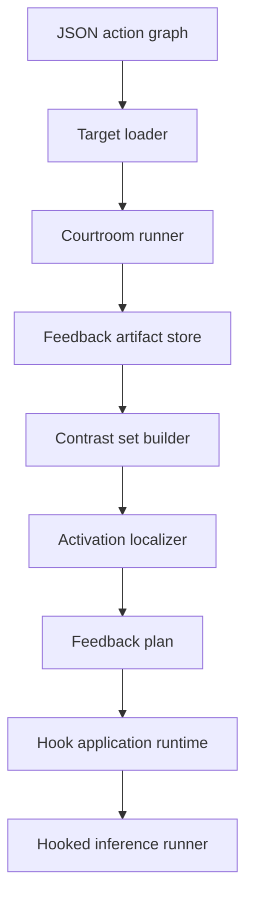

# Specter Validation Architecture

## Purpose

Specter is a standalone validation and activation-steering runtime for expert
model outputs. It consumes a JSON action graph trace, validates answered nodes
through bounded adversarial debate, and turns the strongest validated feedback
into localization and hook artifacts.

The runtime is designed for systems that can export one of these shapes:

- A graph of routed expert queries.
- A workflow DAG with generated answers at some nodes.
- A batch of independent evaluation cases represented as unconnected nodes.
- An agent trace with parent-child task delegation.
- A router log that records which expert handled each request.

## Pipeline



## Input Contract

The target loader expects `specter.action_graph.v1`:

```json
{
  "schema": "specter.action_graph.v1",
  "trace_id": "trace:example",
  "root_query_id": "query:root",
  "nodes": [],
  "edges": []
}
```

Each node with a response becomes a `FeedbackTargetNode`:

```text
FeedbackTargetNode
  query_id
  expert_id
  query
  context
  response
  responses
  child_query_ids
  child_query_texts
  parent_query_id
  parent_query_text
  delegation_query
  depth
  sender_id
```

Edges are optional, but they make delegation validation possible. When a node has
an incoming edge, Specter records the parent query and delegated query text so
the courtroom can test whether the child answer preserved the parent intent.

## Courtroom Runtime

For each target, Specter creates four roles:

| Role | Responsibility |
| --- | --- |
| Prosecutor | Generate and refine concrete failure hypotheses. |
| Defense | Defend the original response against each contention. |
| Judge | Score how strongly the prosecution established the contention. |
| Court reporter | Compress the evolving debate into a running summary. |

The debate loop is bounded by:

- Number of rounds.
- Maximum contention count.
- Contention token budget.
- Defense/prosecution response budgets.
- Judge rationale budget.
- Running-summary budget.

The judge emits `prosecution_strength` in `[-1.0, 1.0]`:

```text
-1.0 = defense clearly wins
 0.0 = mixed or unresolved
 1.0 = prosecution clearly wins
```

The courtroom stage writes:

```text
memory/feedback/<feedback_id>/
  manifest.yaml
  final_feedback.yaml
  targets/<query_id>/
    target.yaml
    contentions.yaml
    rounds.yaml
    debate_summaries.yaml
    judge_scores.yaml
    final_feedback.yaml
```

## Activation Localization

The localization stage consumes final feedback items:

```text
FeedbackItem
  feedback_id
  query_id
  expert_id
  contention_id
  running_debate_summary
  prosecution_strength
  target_query
  target_context
  target_response
```

For each item, Specter builds contrast pairs that preserve the target topic while
adding or removing the validated feedback concept. The localizer then estimates
where that concept is represented in the expert model.

Backends:

| Backend | Use |
| --- | --- |
| `deterministic` | Fast local development, artifact validation, tests. |
| `transformerlens` | Real activation caching, heatmaps, direction vectors, and layer selection. |

Localization writes:

```text
memory/feedback/<feedback_id>/
  activation_localizations.yaml
  activation_heatmaps/*.json
  steering_vectors/*.json
  feedback_plan.json
```

## Feedback Application

The application runtime turns each feedback-plan item into a hook spec:

```text
scaled_vector = direction_vector * prosecution_strength * feedback_scale
```

Each hook records:

- Expert ID.
- Contention ID.
- Layer.
- Hook point.
- Token-position policy.
- Scaled vector.
- Projection strength.
- Confidence.

Applied artifacts are written to:

```text
memory/feedback/<feedback_id>/applied/<application_id>/
  activation_hooks.json
  manifest.yaml
```

## Hooked Inference

The hooked inference runner loads a TransformerLens-compatible model, filters
hook specs by expert ID when requested, and injects each scaled vector into the
configured residual-stream hook point during generation.

This step is intentionally reversible: hook artifacts can be inspected, copied,
discarded, or replayed without changing the underlying model weights.

## Deployment Shape

Small usage:

```text
local JSON trace -> local Specter commands -> filesystem artifacts
```

Scaled usage:

```text
trace producer
  -> queue or object storage
  -> courtroom workers
  -> feedback artifact store
  -> GPU localization workers
  -> hook registry or distillation dataset
  -> expert serving integration
```

Specter does not need to own the upstream application. The only hard boundary is
the JSON action graph input contract.
